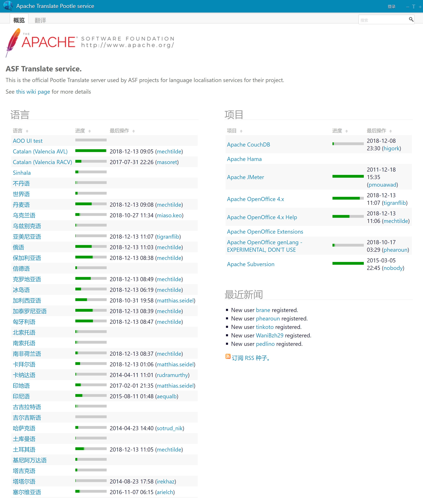
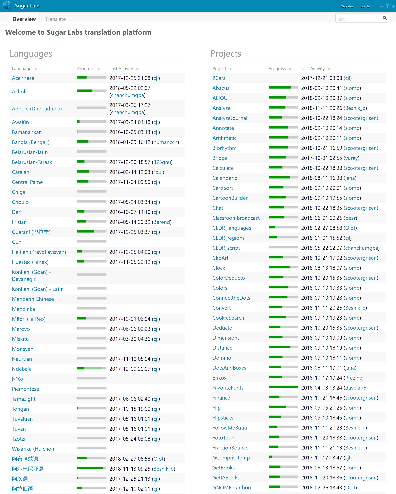
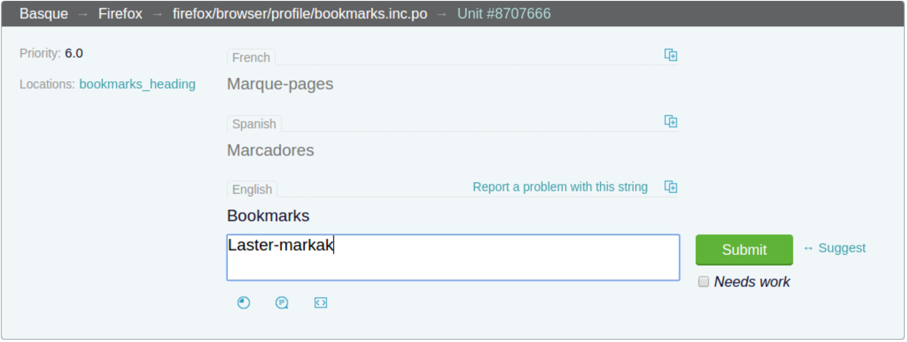
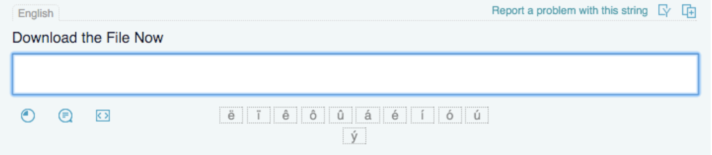
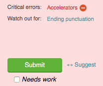
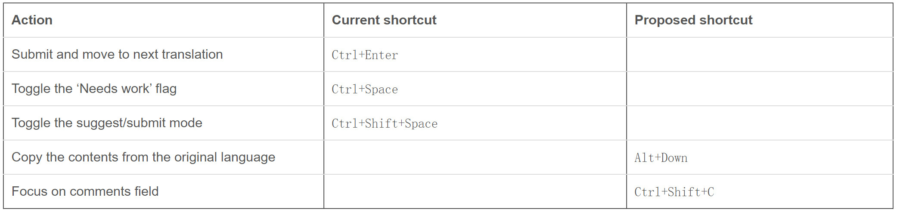
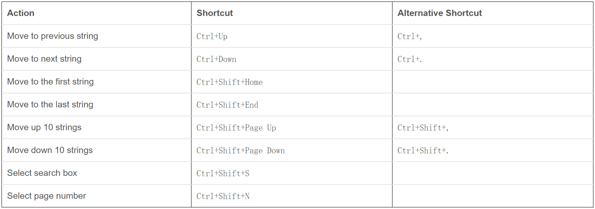

## （一）翻译项目中的沟通

### 1、XXX

### 2、XXX

## （二）翻译人员与技术人员的沟通

### 1、XXX

### 2、XXX

## （三）源语言和目标语言差异

### 1、XXX

### 2、XXX

## （四）翻译平台

### 1、腾讯

### 2、Zanata

### 3、Pootle

名称：基于**PO**的**O**nline **T**ranslation / **L**ocalization **E**ngine的首字母缩写

执照：GLP

#### 背景

- 2004	Translate.org.za开发和发布、免费**

  最早是由CATIA项目（非洲本地化网络）资助的项目中开发。

  使用[Django框架](https://en.wikipedia.org/wiki/Django_(web_framework))以[Python编程语言](https://en.wikipedia.org/wiki/Python_(programming_language))编写。

  **Catalysing Access to ICT in Africa**

  https://web.archive.org/web/20070117142810/http://www.catia.ws/

- **2006	作为WordForge项目进一步开发**

#### 设计理念

- 免费、鼓励项目托管自己的Pootle服务器以进行本地化。
- 使用Translate Toolkit的API和Django framework。作为翻译管理系统 ，把翻译文件视为文档进行管理。
- 能够同上游的版本控制系统交互，直接在项目内提交变更，而不是维护一个平行的系统。

**Notes：**

​	**PO文件：**

​	提取于源代码的一种资源文件，可使用Gettext获取。可以在一定程序上使翻译成果得到继承。

​	**Translate Toolkit：**

​	http://docs.translatehouse.org/projects/translate-toolkit/en/latest/features.html

​	目的是提高本地化和翻译质量。使用PO和XLIFF格式。

​	首先把文件转换为这两种基本格式。

​	其次提供工具来提取术语和检查术语一致性，能够检查各种技术错误，例如正确使用变量。

​	最后提供了一个功能强大的本地化API，可以作为其他工具的基础。

#### 使用Pootle的项目

##### **(1) OpenOffice.org**

https://en.wikipedia.org/wiki/OpenOffice.org#Apache_OpenOffice

OpenOffice是一个办公套件，2000年由Sun公司收购并发布商业版本，2011年Oracle公司将其捐赠给Apache软件基金会。

The Apache Software Foundation 使用了Pootle的服务，以简单、合作的方式完成产品的本地化工作。

OpenOffice 支持了120+种语言，目前有40+种是在Pootle上维护的，并且这个数量也正逐渐增加。

https://wiki.openoffice.org/wiki/Pootle_User_Guide

**Official Pootle Translate server used by ASF projects:**

##### **(2) Verbatim**（**mozootle**）

https://wiki.mozilla.org/Verbatim

Verbatim是Mozilla的Pootle服务器的产品代号，也称为Mozootle。

Pootle的使用介绍（Mozilla Demo）

​	https://www.youtube.com/watch?reload=9&v=u6tDUQv3huU

​	translation

​	make a suggestion

​	review suggestion mode

​	checks

##### **(3) Sugar (software)**

Sugar是一个免费开源的桌面环境，为儿童的互动学习而设计。Sugar labs旗下开发。跨平台。

https://translate.sugarlabs.org/

#### Features

http://docs.translatehouse.org/projects/pootle/en/latest/features/index.html

##### 1、Pootle FS

- 可以与各种版本控制系统（VCS）集成。Pootle FS通过插件为不同的VCS系统提供支持。为VCS安装Pootle的插件，在VCS中为Pootle提供同步访问权限（SSH密钥）即可。

##### 2、Backends and storage

- 通过Translate Toolkit API支持多种文件格式。

- 提供翻译进展的统计信息。

- Translate Toolkit的pofilter提供的质量检查。

  http://docs.translatehouse.org/projects/translate-toolkit/en/latest/commands/pofilter.html#pofilter

##### 3、Online translation editor

- Alternative source language

  翻译时可以查看其他语言的翻译以消除歧义。用户可以在帐户设置中设置希望显示的语言。

  

- Special characters

  对于各种语言中，键盘上不方便输入的字符，在编辑区提供选择。用户可以直接点击使用。

  

- Quality checks

  质量问题会明显地显示在页面上方。

  

  对于重要错误，会显示在提交按钮前。用户需要修改或者Mute。

  

- Translation Memory

  用户可以使用远程的/本地的/外部的翻译记忆库

- Machine Translation

  可以配置文件中启用机器翻译服务。

  支持：Google Translate 和 Yandex.Translate

- Searching in Pootle

  提供高级搜索，将搜索内容限定在特定字段，词组匹配，大小写限制等。

- Keyboard shortcuts

  提供键盘快捷键操作。

  

  

- Translation suggestions

  提出建议：有权提出建议的用户将看到“提交”旁边的“建议”按钮。

  查看建议：具有翻译权限的用户才可以查看建议。在翻译时可以查看建议，或者可以浏览所有建议。

  审核建议：批准或者拒绝建议。

- Terminology

- Offline Translation

  用户可以将待翻译的文本导出进行离线翻译。完成后再上传。

##### 4、Administrative features

- 管理团队成员：

  添加和删除成员，并设定其角色。不同角色具有不同权限。

  4种角色：Member、Submitter、Reviewer、Administrator

- 设置验证码

- 权限

  可为不同的用户组设定不同的权限。

  访问权限（对项目的访问）、动作权限（建议、审查、翻译、管理等）

#### **其他Pootle Servers**

http://translate.sourceforge.net/wiki/pootle/live_servers

​	Public Pootle Servers

​	Non-Public Pootle Servers

### 4、Translation5

